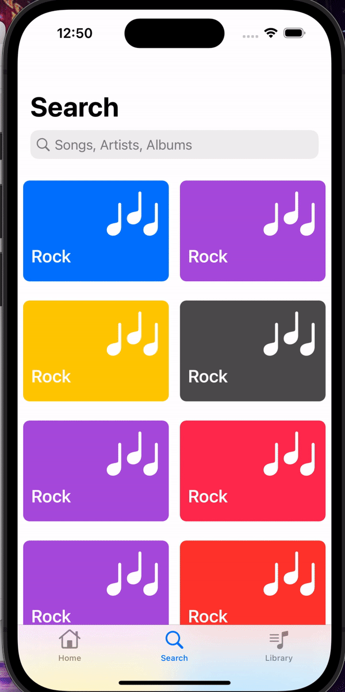

Original App Design Project - README
===

# Kpop Soul
Kpop Soul is an iOS app developed using SwiftUI, which leverages the Spotify Web API to showcase K-pop (Korean) artists and their albums. The app provides an immersive experience for K-pop fans by offering a seamless and intuitive interface for browsing and discovering their favorite artists and albums. 

Upon launching the app, users are presented with a login and signup page, where they can either sign in using their existing Spotify account or create a new one. This integration with Spotify ensures a personalized experience tailored to the user's music preferences. 

Once signed in, the Home page displays a searchable table view of various K-pop artists. Each artist entry includes essential information such as their name and profile picture. By selecting an artist from the list, users are navigated to a dedicated artist page. 

The artist page features a visually appealing collection view of the artist's albums, accompanied by the artist's icon and a brief introduction at the top of the view. Users can further explore individual albums by clicking on them, revealing additional information and enhancing their overall K-pop experience. 

Kpop Soul aims to provide a comprehensive and engaging platform for K-pop enthusiasts, making it easy to explore and enjoy the vibrant world of Korean music through the power of the Spotify Web API. By integrating features like account authentication, artist search, and album exploration, Kpop Soul delivers a rich and interactive experience for its users. 

## Video Walkthrough
Here's a walkthrough of implemented user stories:
<!--  -->

# Previous Design (Music Soul)

## Table of Contents
1. [Overview](#Overview)
2. [Product Spec](#Product-Spec)
3. [Wireframes](#Wireframes)
4. [Schema](#Schema)

## Overview
### Description
This app shares the latest information on artists with users and could be used to build a community for users interested in the same artists. It could be potentially used to meet new friends or organize an artist's supporters' association. 

### App Evaluation
[Evaluation of your app across the following attributes]
- **Category:** Social Networking / Music
- **Mobile:** This app would be primarily developed for mobile but would perhaps be just as viable on a computer, such as Bumble, Spotify, QQ music or other similar apps. Functionality wouldn't be limited to mobile devices, however mobile version could potentially have more features.
- **Story:** Gathers comments and opinions of music lovers, helps people keen on exploring new music, users can leave comments and provide information for other users
- **Market:** Any individual could choose to use this app, and to keep it a safe environment.
- **Habit:** This app could be used as often or unoften as the user wanted depending on how much they love discussing music and commenting on different artists. They may look at others' comments and share their thoughts on their favorite musics. Notifications will be set to remind them to come back to look at comments of their favorite music.
- **Scope:** First, we would start with showing users a list of different artists and the users can click to select different artists to view all their albums. Users may use the search bar to look for their target artists or albums. After selecting a particular album, users who has signed up and logged in can see the likes and comments from other users, and they can also leave their comments there. This could potentially evolve into a music sharing application like Spotify, Apple Music, QQ music, or other music-related applications by broadening its usage.

## Product Spec

### 1. User Stories (Required and Optional)

**Required Must-have Stories**

* User logs in to access app.
* User picks what their favorite artist.
* Album pages for each artist.
* Detailed album page with comments from music lovers.

**Optional Nice-to-have Stories**

* Settings (Accesibility, Notification, General, etc.)
* Music lovers' profile.
* Page of most played songs.

### 2. Screen Archetypes

* [Homepage]
   * Search artists or album
   * Display of Artists and Singers image and short description(Table View)
* [Artist Detail Page]
   * Detail Information of one Particular Artist
   * Display of all Albums of this Artist(Collection View)
* [Album Detail Page]
    * Detail Information of one particular album
    * List of comments posted for the particular album (Table View)
    * type text and post comments for a particular album
    * Reply a comment
    * Like a comment 
* [Login]
    * login
* [SignUp]
    * sign up with email

### 3. Navigation

**Tab Navigation** (Tab to Screen)

* Home Screen(tab bar icon:Home)
    * user sign up, login in / out
    * search bar for albums and artists
* Artist detail Screen (push from Home screen): 
    * display detailed information of a particular artist
    * display a collection view of all albums of the artist
    * search bar for one particular song
* Album detail Screen (push from Artist detail screen)
    * a table of all the comments for the particular album
    * users' comments, likes and replies to the comments for a particular album
* Profile Screen
    * display user's information
    * display user's comments and likes
    * display the most played songs
* Setting Screen
    * modify notification preferences and account information

**Flow Navigation** (Screen to Screen)

* Home Screen
   * user can search for album / artist in the search bar
   * click on an artist -> artist detail screen
* Artist detail Screen
   * click on an album -> Album detail screen
   * click on the back button on the navigation bar -> back to the Home Screen
* Album detail Screen
    * click the "Add comment" button -> post a comment
        * click on the heart icon -> like a comment
        * click the reply buttion -> reply to a comment 
    * click on the back button on the navigation bar -> back to the Artist detail Screen
* Profile Screen
    * see their comments and likes
    * edit profile info
    * click on the back button on the navigation bar -> back to the Home Screen
* Setting Screen
    * modify notification & preferences
    * click on the back button on the navigation bar -> back to the Home Screen

## Wireframes
[Add picture of your hand sketched wireframes in this section]

### [BONUS] Digital Wireframes & Mockups
same as above

### [BONUS] Interactive Prototype

## Schema 
[This section will be completed in Unit 9]

### Models
User: ParseObject {
    var objectId: String?
    var createdAt: Date?
    var updatedAt: Date?
    var lastPostedDate: Date?
    var ACL: ParseACL?
    var originalData: Data?
    var username: String?
    var email: String?
    var emailVerified: Bool?
    var password: String?
    var authData: [String: [String: String]?]?
}

Artist: ParseObject {
    let artistName: String
    let artworkUrl100: URL
}

### For Collection View
struct AlbumSearchResponse: Decodable {
    let results: [Album]
}

Album: ParseObject {
    let artistName: String
    let arrayOfSongNames: [String]
    # Icon Picture
    let artworkUrl100: URL
}

Post: ParseObject {
    User: User?
    Album_ID: String?
    Text: String?
    PostID: String?
    Post : [Comment]
}

Comment: ParseObject {
    User: User?
    PostID: String?
    Text: String?
}

### Networking
- [Add list of network requests by screen]
- GET, POST
- [Create basic snippets for each Parse network request]
- Artist, Albums
- Apple iTunes: 
- https://itunes.apple.com/search?term=jack+johnson.
- Spotify: 
- https://api.spotify.com/v1/albums/{id}
- https://api.spotify.com/v1/artists/{id}
- [OPTIONAL: List endpoints if using existing API such as Yelp]
- iTunes Search API: https://developer.apple.com/library/archive/documentation/AudioVideo/Conceptual/iTuneSearchAPI/index.html# 
- Spotify Web API: https://developer.spotify.com/documentation/web-api
